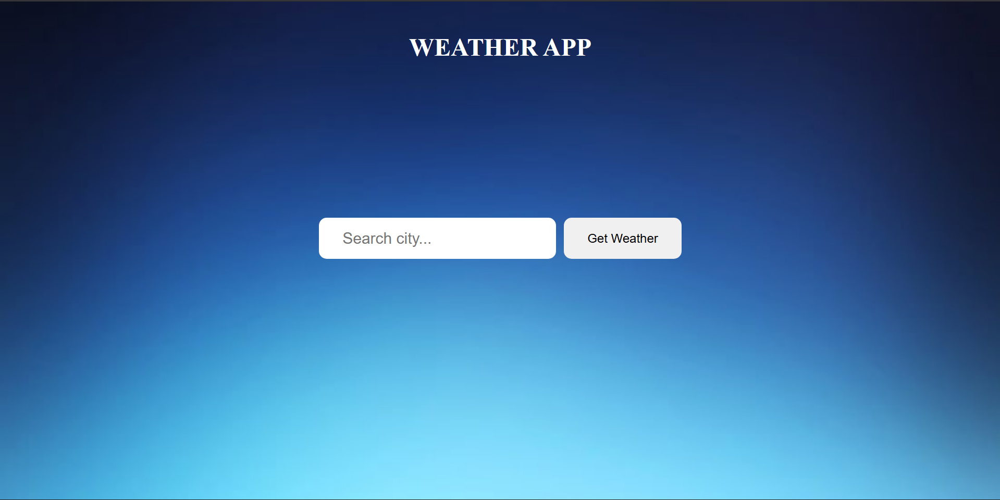
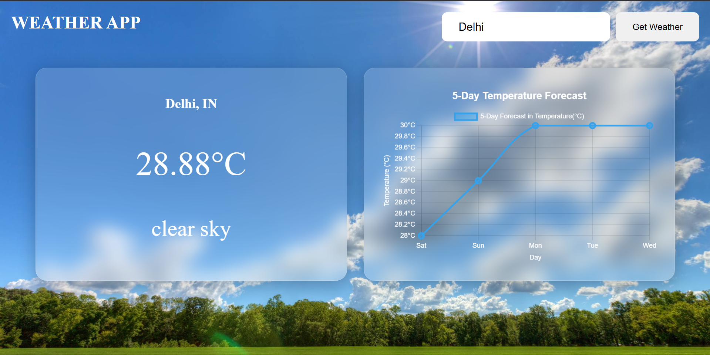
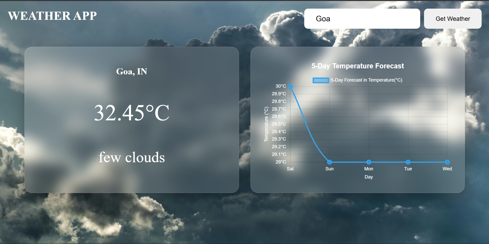

# 🌦️ Weather App

A modern weather application built using **HTML, CSS, and JavaScript** that allows users to search for any city and view real-time weather data along with a 5-day temperature forecast graph.

---

## 🚀 Features

- 🔍 Search weather by city name
- 🌡️ Displays temperature in Celsius
- 🏙️ Shows city name and weather description
- 📊 5-Day temperature forecast graph (Chart.js)
- 🧊 Glassmorphism UI design
- 📱 Responsive layout (Desktop + Mobile)
- ❌ Handles invalid city search (error message + reset)

---

## 🛠️ Technologies Used

- HTML5
- CSS3 (Glassmorphism + Responsive Design)
- JavaScript (ES6)
- OpenWeather API
- Chart.js (for forecast graph)

---

## 🔑 API Key Setup

This project uses the OpenWeather API.

1. Create a free account at:
   https://openweathermap.org/

2. Generate an API key.

3. Open `script.js` and replace:

```javascript
const apiKey = "YOUR_API_KEY";
```

---

### ▶️ How to Run Locally

1. Clone the repository:
   ```
   git clone https://github.com/your-username/Weather-App.git
   ```

2. Open the folder.
3. Double-click `index.html`

---

### 🎨 UI Highlights

- Frosted glass effect using:
  ```
  backdrop-filter: blur(15px);
  ```
- Smooth transitions when:
  - Heading moves to top-left
  - Search bar moves to top-right
- Search bar moves to top-right

---

### ⚠️ Notes

- API requests by city name may be deprecated in future versions of OpenWeather.

---

### 📸 Screenshot







---

### 📌 Future Improvements

- Add weather icons
- Add air quality index
- Add dynamic background based on weather condition
- Add dark/light theme toggle
- Add geolocation support

---
